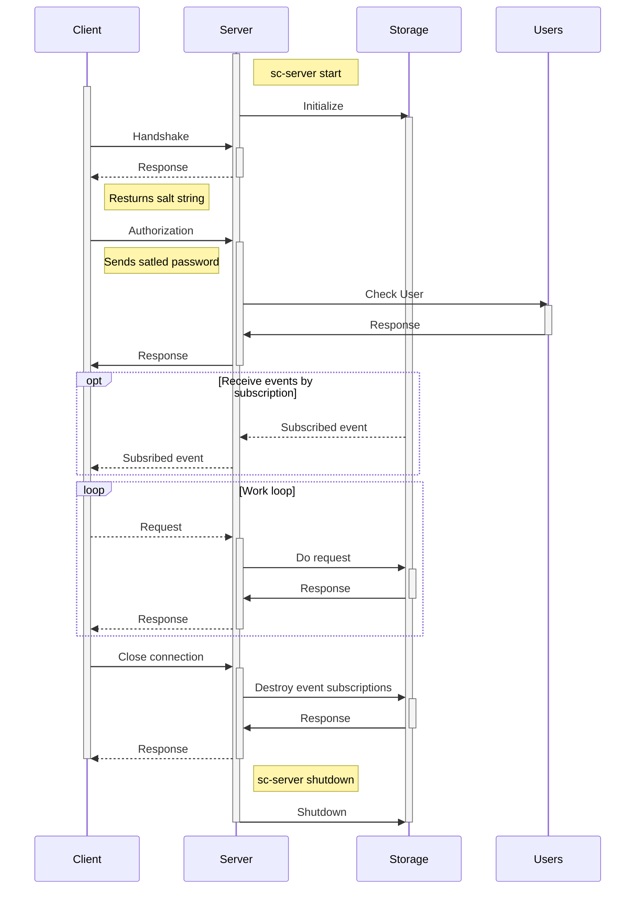

# SCTP - SC-Code transport protocol

SCTP protocol is designed to implement efficient two sided communication between the `sc-server` and client by network.
It could be implemented with different programming languages. It has two implemntations that differ by underlaying format:

- json
- binary (in progress)

This is a common workflow sequence:

See `sctp.proto` file for more information